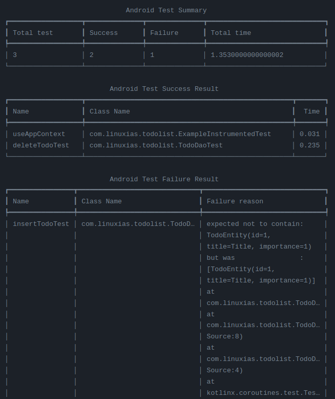

# Android-test-result-printer

It is an action that prints the results of the Android test in a human-friendly and readable form.



## Usage

### 1. Run unit test only
```yml

name: Android CI

on:
  push:
    branches: [ "main" ]
  pull_request:
    branches: [ "main" ]

jobs:
  test:
    runs-on: ubuntu-latest
    steps:
      - uses: actions/checkout@v3
      - name: set up JDK 11
        uses: actions/setup-java@v3
        with:
          java-version: '11'
          distribution: 'temurin'
          cache: gradle

      - name: Run unit test
        run: ./gradlew testDebugUnitTest

      - name: Android Test Report
        uses: linuxias/Android-test-result-printer@v0.1.0
```

### 2. Run with instrumented test
If you want to perform the instrumented test, you need an emulator environment. I recommend [android-emulator-runner](https://github.com/marketplace/actions/android-emulator-runner) action) as an environment for testing.

There are points to be careful when using the action mentioned above. The action is performed with macos, and the 'report action' is performed on the ubuntu basis. For this reason, two cannot be operated in one OS.

Therefore, the following methods are recommended.

```yml
name: Android CI

on:
  push:
    branches: [ "main" ]
  pull_request:
    branches: [ "main" ]

jobs:
  build:
    runs-on: macos-latest

    steps:
    - uses: actions/checkout@v3
    - name: set up JDK 11
      uses: actions/setup-java@v3
      with:
        java-version: '11'
        distribution: 'temurin'
        cache: gradle

    - name: Set up Android SDK
      uses: android-actions/setup-android@v2

    - name: Grant execute permission for gradlew
      run: chmod +x gradlew

    - name: Build with Gradle
      run: ./gradlew app:assembleDebug

    - name: Run instrumented test
      uses: reactivecircus/android-emulator-runner@v2
      with:
        arch: 'x86_64'
        api-level: 30
        script: ./gradlew app:connectedDebugAndroidTest

    - name: Upload Test Reports Folder
      uses: actions/upload-artifact@v2
      if: ${{ always() }}
      with:
        name: test-project
        path: ./test-project

  report:
    runs-on: ubuntu-latest
    needs: build
    if: ${{ always() }}
    steps:
    - name: Download Test Reports Folder
      uses: actions/download-artifact@v2
      with:
        name: test-project

    - name: Report test result
      uses: linuxias/Android-test-result-printer@v0.1.0

```


### The path of test result what test with gradle
|Unit Test Type|HTML test result files|XML test result files|
|---|---|---|
|Local|`path_to_your_project/module_name`/build/reports/tests/|`path_to_your_project/module_name`/build/test-results/|
|Instrumented|`path_to_your_project/module_name`/build/reports/androidTests/connected/|`path_to_your_project/module_name`/build/outputs/androidTest-results/connected/|
